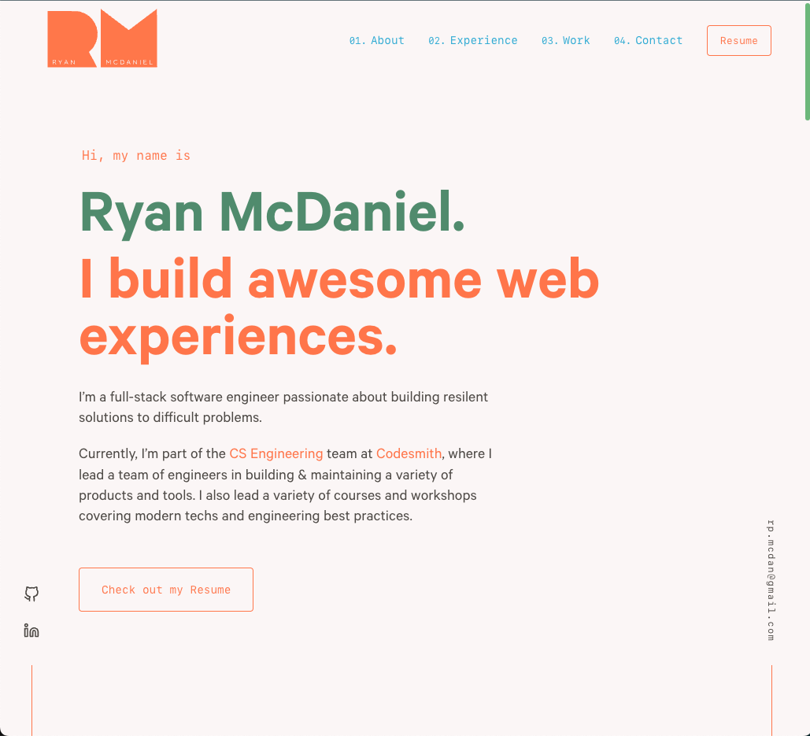

  

<h1 align="center">
  ryanmcdaniel.io - v1
</h1>

  The first iteration of <a href="https://ryanmcdaniel.io" target="_blank">ryanmcdaniel.io</a> built with <a href="https://www.gatsbyjs.org/" target="_blank">Gatsby</a> and hosted with <a href="https://www.netlify.com/" target="_blank">Netlify</a>. Forked from the amazing <a href="https://github.com/bchiang7" target="_blank">Brittany Chiang</a> and iterated on by yours truly.

---
